  <picture>
    <source media="(prefers-color-scheme: dark) and (max-width: 600px)" srcset="./assets/hero-mobile-dark.svg" />
    <source media="(prefers-color-scheme: light) and (max-width: 600px)" srcset="./assets/hero-mobile-light.svg" />
    <source media="(prefers-color-scheme: dark)" srcset="./assets/hero-dark.svg" />
    
  </picture>

  <a href="https://fredrickagyare.is-a.dev">Portfolio</a> &nbsp;/&nbsp;
  <a href="https://www.linkedin.com/in/fredrick-agyare-9887a0244">LinkedIn</a> &nbsp;/&nbsp;
  <a href="mailto:agyarefredrick22@gmail.com">Email</a>

**Backend Engineer | Applied AI for Fintech and Regulated Systems**

I build backend services, data workflows and applied AI features for systems where money, identity,
evidence and automated decisions need to remain correct. My engineering priorities are explicit
state, secure boundaries, useful tests, observable operations and recoverable failure modes.

## What I build

<table>
  <tr>
    <td width="100%">
      <strong>01 / Backend and fintech systems</strong> 
      APIs, transaction workflows, ledgers, reconciliation and background processing designed
      around idempotency, auditability and failure recovery. 
      Python · FastAPI · Django · PostgreSQL · Redis · payments
    </td>
  </tr>
  <tr>
    <td width="100%">
      <strong>02 / Applied AI and data workflows</strong> 
      Evaluated ML and LLM services, retrieval systems and document workflows with monitoring,
      rollback paths and human review where correctness matters. 
      PyTorch · scikit-learn · Hugging Face · pandas · NumPy · RAG evaluation
    </td>
  </tr>
  <tr>
    <td width="100%">
      <strong>03 / Product delivery and operations</strong> 
      Full-stack and mobile product delivery backed by automated tests, reproducible deployment,
      infrastructure controls and practical production runbooks. 
      TypeScript · React · React Native · Docker · Linux · CI/CD · Terraform
    </td>
  </tr>
</table>

## Working with

`Python` `TypeScript` `JavaScript` `SQL` `FastAPI` `Django` `PostgreSQL` `Redis`
`React` `Docker` `Linux` `Git` `GitHub Actions` `DigitalOcean` `Cloudflare` `Playwright`

## Building depth in

`React Native` `Expo` `PyTorch` `scikit-learn` `Hugging Face` `MLOps` `Terraform`
`system design` `RAG evaluation` `model monitoring` `financial data systems`

## Selected systems

Public project entries appear here only after their setup, tests, security review, architecture and
my contribution are independently defensible. The same verified releases become the profile's
three to five pinned repositories.

  Accra, Ghana &nbsp;·&nbsp; Available for backend, fintech and applied AI engineering work

