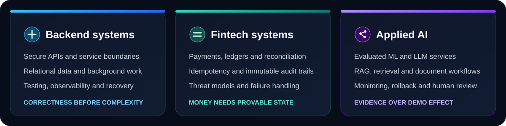

  <picture>
    <source media="(max-width: 600px)" srcset="./assets/profile-hero-mobile.svg" />
    
  </picture>

  
  
  

I build backend services, data workflows and applied AI features with an emphasis on auditability,
security and operational reliability. My work is centered on systems that need to remain correct
when money, identity, evidence and automated decisions are involved.

## What I build

  <picture>
    <source media="(max-width: 600px)" srcset="./assets/capabilities-mobile.svg" />
    
  </picture>

## Engineering toolkit and direction

This is the toolkit I use in senior product work and the technologies I am deliberately deepening
as I expand across backend, fintech, applied AI and production delivery. The badges describe
direction and working scope, not equal mastery of every tool.

### Languages and foundations

### Backend, web and mobile

### Data, AI and machine learning

### Delivery and operations

### Fintech and regulated-system concerns

## Selected work

Project cards are published only after reproducible setup, tests, security review, architecture
documentation and a verified account of my contribution. The next verified releases will appear
here and in the pinned repositories.

## Activity snapshot

  

Activity is context, not a proficiency score. Projects and independently defensible evidence
carry the engineering claims.
